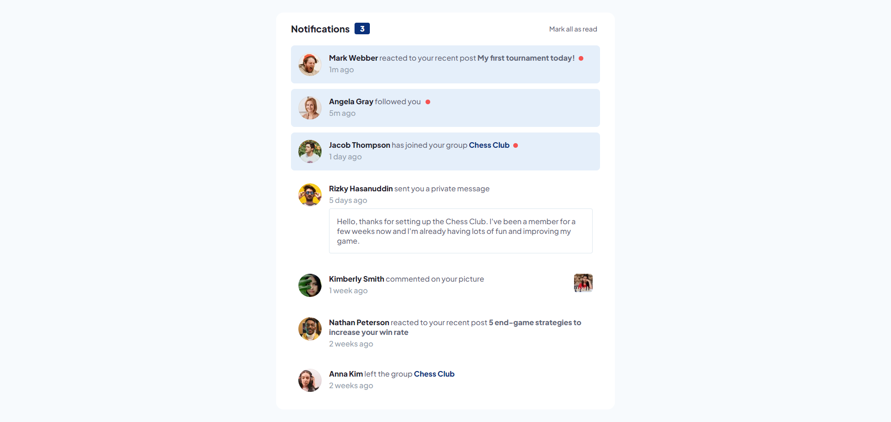

# Frontend Mentor - Notifications page solution

This is a solution to the [Notifications page challenge on Frontend Mentor](https://www.frontendmentor.io/challenges/notifications-page-DqK5QAmKbC). Frontend Mentor challenges help you improve your coding skills by building realistic projects. 

## Table of contents

- [Overview](#overview)
  - [The challenge](#the-challenge)
  - [Screenshot](#screenshot)
  - [Links](#links)
- [My process](#my-process)
  - [Built with](#built-with)
  - [What I learned](#what-i-learned)
  - [Continued development](#continued-development)
  - [Useful resources](#useful-resources)
- [Author](#author)

## Overview

### The challenge

Users should be able to:

- Distinguish between "unread" and "read" notifications
- Select "Mark all as read" to toggle the visual state of the unread notifications and set the number of unread messages to zero
- View the optimal layout for the interface depending on their device's screen size
- See hover and focus states for all interactive elements on the page

### Screenshot

### Link

- Live Site URL: [My solution](https://jorge-sanchez09.github.io/notifications-page/)

## My process

### Built with

- Semantic HTML5 markup
- CSS custom properties
- Flexbox
- CSS Grid
- Mobile-first workflow
- [React](https://reactjs.org/) - JS library
- [Styled Components](https://styled-components.com/) - For styling
- [Vite](https://vitejs.dev) - For app build process

### What I learned

This is my first Frontend Mentor challenge using React. It was a good opportunity to practice this library as I have been learning it for over 2-3 weeks.

I believe I gained a better grasp of React's essential concepts like props and state. Managing notifications state was interesting and I think I did it well enough.

Regarding the styles, I decided to use styled-components since it's another technology I've only had a little time to explore, so I thought I should use it more often to learn about more styling alternatives.

### Continued development

My goal is to continue learning about React and tackle more challenging projects, so I can confidently add this technology to my developer toolkit.

### Useful resources

- [Deploying a Static Site with Vite](https://vitejs.dev/guide/static-deploy.html#github-pages) - This helped me to make my first vite project deployment.

## Author

- Frontend Mentor - [@Jorge-sanchez09](https://www.frontendmentor.io/profile/Jorge-sanchez09)
